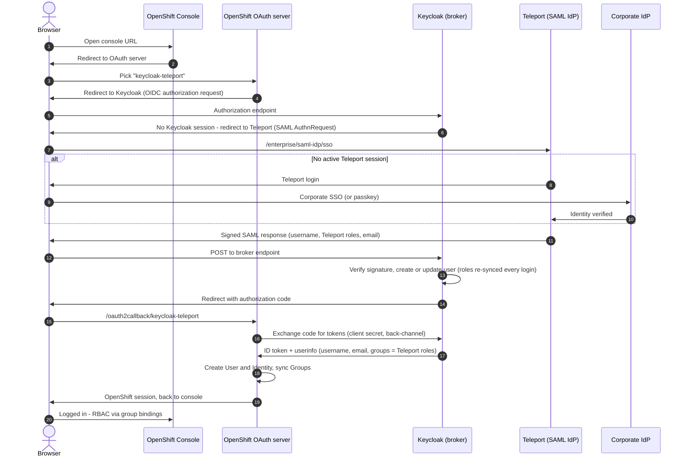

# OpenShift Console SSO with your Teleport identity

Log into the RedHat OpenShift web console (and `oc login --web`) as your
**Teleport** user, with your Teleport **roles** deciding what you can do in the
cluster. One browser click takes you from the console's login page through
Teleport and back — no kubeadmin password, no separate OpenShift account.

```
you → OpenShift Console → OpenShift OAuth server → Keycloak → Teleport → done
                          (speaks OIDC)            (translates)  (speaks SAML)
```

And it's built to run without long-lived credentials: **exactly one shared
secret exists in the whole setup** (OpenShift's OAuth schema mandates it), it
lives only in two Kubernetes Secrets, never touches a laptop or a ConfigMap,
and rotates with one command. Details in
[Credential posture](#credential-posture).

For the trust boundaries, session model, identity mapping, and compromise
analysis, see [docs/architecture.md](docs/architecture.md).

## Why is Keycloak in the middle?

Short version: **OpenShift and Teleport don't speak a common login protocol**,
so something has to translate. That's the entire job Keycloak does here.

The longer version:

- The OpenShift console doesn't authenticate users itself — it hands you to the
  cluster's built-in **OAuth server**, which supports a fixed list of identity
  provider types: htpasswd, LDAP, GitHub, GitLab, Google, Keystone,
  request-header, basic-auth, and **OpenID Connect (OIDC)**. Notably absent:
  SAML, and any kind of "trust a JWT header" option.
- **Teleport can act as an identity provider, but only over SAML** (the
  Enterprise "Teleport as a SAML IdP" feature). Teleport has no OIDC provider
  for third-party apps.
- So: OpenShift's best option is OIDC, Teleport's only option is SAML, and
  **Keycloak brokers between them** — it logs you in via Teleport (SAML),
  then presents you to OpenShift as an OIDC user. Your Teleport roles ride
  along the whole way and become OpenShift groups.

Jargon decoder (one-liners):

| Term | Meaning |
|---|---|
| **IdP** (identity provider) | The system that says who you are (here: Teleport) |
| **SAML** | An XML-based single-sign-on protocol; Teleport's IdP speaks it |
| **OIDC** (OpenID Connect) | A JSON/OAuth2-based single-sign-on protocol; OpenShift consumes it |
| **Broker / bridge** | A service that logs in against one protocol and serves the other (here: Keycloak) |
| **ACS URL** | "Assertion Consumer Service" — the SAML callback URL where Teleport sends the signed login response |

### Why not something simpler?

| Option | Why it doesn't work |
|---|---|
| Teleport app-access JWT (the Grafana pattern) | The console has no equivalent of Grafana's `auth.jwt` — it only trusts its OAuth server. The Teleport JWT's issuer/audience are also fixed values OpenShift's OIDC validation would reject. |
| OpenShift's request-header identity provider | Requires the authenticating proxy to present an mTLS client certificate signed by a CA you give the OAuth server. Teleport app access can't present one. |
| Teleport as OIDC provider directly | Doesn't exist — Teleport's IdP is SAML-only (verified against current Teleport source). |
| Dex instead of Keycloak | Dex's SAML connector is officially unmaintained and flagged by the Dex project as "likely vulnerable to authentication bypass". Keycloak's SAML brokering is fully maintained. |

## App access or identity federation?

Teleport offers two fundamentally different ways to put an application behind
your Teleport identity, and this repo uses the less-obvious one. Understanding
the difference tells you which pattern fits any given app — and why both can
show up as tiles in Teleport's resource catalog for the same application.

**App access proxies the traffic.** Teleport acts as an authenticated reverse
proxy: the browser talks to a Teleport-issued address, Teleport checks its own
front door (your session, roles, MFA), then forwards the HTTP traffic to the
app. Teleport sits *in the data path*, which is what buys you a Teleport-side
audit of the app session (HTTP request logging) and reach into apps that
aren't exposed publicly. What it does **not** do is log you into the app: the
app behind the proxy still has its own front door. App access can only pass
your identity through that door when the app accepts an injected identity —
in practice a JWT header (Grafana's `auth.jwt` is the canonical example).

**Identity federation makes Teleport the app's identity provider.** Nothing is
proxied — the app keeps its own front door and is taught to *ask Teleport who
you are* (here: via Keycloak translating the console's OIDC to Teleport's
SAML). Teleport is not in the data path at all; it's the authority that
vouches for you at login. The payoff is that your identity lands **inside the
app's own authorization model**: OpenShift mints a real User, syncs your
Teleport roles as Groups, its native RBAC takes over, and its audit logs
attribute every action to the real person. It also covers non-browser entry
points (`oc login --web`) that a proxy never sees.

The audit trade is worth stating precisely. With federation, Teleport records
the *authentication* (the SAML IdP login event) but none of the app usage —
usage auditing moves into the app's own logs, where it gains real usernames.
With app access, Teleport records the HTTP session but the app may not know
who you are at all. The JWT pattern is the best of both worlds when the app
supports it; for Kubernetes specifically, remember that CLI access through a
Teleport kube agent is fully session-recorded by Teleport regardless of how
console SSO is done — the two paths complement each other.

| App supports | Use | Login identity | Usage audit lives in |
|---|---|---|---|
| OIDC or SAML | **Identity federation** via Teleport's SAML IdP (this repo) | Lands in the app's own user/RBAC model | The app's logs, with real names; Teleport logs the login |
| JWT header | **App access + `rewrite.headers`** (the Grafana pattern) | Injected per request | Both — Teleport logs the HTTP session *and* the app knows the user |
| Neither | **App access** as an audited tunnel | App's own separate login | Teleport logs the HTTP session; app identity is disconnected |

The two patterns aren't mutually exclusive — an app whose base URL and OAuth
redirect URIs you control can sit behind app access *and* federate. The
OpenShift console can't, cleanly: its OAuth redirect URIs are pinned to its
public route, so a login started behind the proxy escapes to the direct URL
mid-flow. For the console, federation is simply the right tool.

## How a login works



In words:

1. The console hands you to the cluster's OAuth server, which lists its
   identity providers (`kube:admin` plus `keycloak-teleport`, until you remove
   kubeadmin).
2. Picking `keycloak-teleport` starts a standard OIDC authorization-code flow
   against Keycloak. Keycloak has no users or login page of its own — it
   immediately forwards the browser to Teleport as a SAML request.
3. **Teleport is where authentication actually happens**, with whatever your
   cluster already enforces: corporate SSO, passkeys, MFA, device trust. If
   you already have a Teleport web session, this hop is invisible.
4. Teleport returns a signed SAML assertion carrying your username, your
   Teleport role names, and your email. Keycloak verifies the signature
   (public certificate — Keycloak holds no Teleport credential), updates its
   user record, and sends the browser back to OpenShift with an authorization
   code.
5. The OAuth server redeems the code over a back-channel call to Keycloak —
   the only server-to-server hop, and the only place the setup's one shared
   secret is used — then creates/updates your OpenShift User and syncs your
   Groups from the roles claim.
6. From here it's ordinary Kubernetes RBAC: the group bindings in
   `openshift/40-rbac-group-bindings.yaml` decide what you can do.

Every hop except the code redemption travels through your browser — no
component ever holds credentials for another system, and role changes in
Teleport flow through on the next full login.

### Where the identity comes from

If your users reach Teleport through a corporate identity provider (Okta,
Entra ID, Google, GitHub — or passkeys), it's worth being precise about whose
identity OpenShift actually receives, because Teleport plays **both SAML
positions at once**:

- **Upstream, Teleport is a service provider**: your corporate IdP
  authenticates the human — password, MFA, its own device policies — and
  asserts them to Teleport once, at login.
- Teleport then **mints its own identity** from that assertion: the SSO
  connector's attribute mapping converts IdP groups into *Teleport roles*, IdP
  attributes become *traits*, and Teleport issues its own short-lived session.
  From here the living identity is Teleport's — it can gain a role through an
  Access Request, lose one, or be locked, all without the corporate IdP
  knowing.
- **Downstream, Teleport is the identity provider**: when the console flow
  arrives, Teleport answers from that session — it does *not* bounce you back
  to the corporate IdP. The SAML assertion carries your Teleport username and
  your Teleport roles **as they are at that moment**, including just-in-time
  grants your upstream IdP has never heard of.

The chain reads: *your IdP proves who you are → Teleport decides what you are
→ OpenShift consumes Teleport's decision.* Two practical consequences:

1. **Policy consolidation** — whatever Teleport enforces at its own door
   (per-session MFA, hardware keys, Device Trust) automatically gates every
   application behind its IdP, including this console, with zero
   OpenShift-side configuration.
2. **Revocation flows down with a lag per layer** — disabling a user upstream
   stops *new* Teleport sessions but not existing ones; a **Teleport lock**
   kills the Teleport layer immediately, and with it every future SAML
   assertion. Below that, the Keycloak and OpenShift session TTLs are the
   remaining lag (see the
   [session model](docs/architecture.md#session-model)).

One operational nuance for SSO-backed users: Teleport recomputes their role
*list* from the connector's attribute mapping on every corporate-IdP login.
Grant durable access through roles the connector maps (or via Access Lists,
or by extending a role they already hold) — a one-off `tctl users update` on
an SSO user is silently undone at their next login.

### What you end up with

- Keycloak runs **inside the OpenShift cluster** as a single small pod. Its
  entire configuration is one JSON file in this repo — no database, nothing to
  back up, **no admin account**. If the pod restarts, the config re-imports
  itself.
- Your **Teleport roles become OpenShift groups**, re-synced on every login:

  | Teleport role | OpenShift group | ClusterRole granted |
  |---|---|---|
  | `full-access` | `full-access` | `cluster-admin` (everything) |
  | `editor` | `editor` | `edit` (change most things) |
  | `access` | `access` | `view` (read-only) |

  (These are example role names — edit `openshift/40-rbac-group-bindings.yaml`
  to match the Teleport roles in your cluster.)

  Because group names are just Teleport role names, a role you receive through
  a Teleport **Access Request** shows up as a new OpenShift group the next time
  you log in — just-in-time elevation, visible in the console.
- `kubeadmin` keeps working the whole time (and once you've verified SSO,
  [you can remove it](#step-10-optional--remove-kubeadmin)). Nothing here is
  one-way except that final optional step; see
  [Teardown](#teardown--rollback).

## Prerequisites

- A **Teleport Enterprise** cluster (the SAML IdP is an Enterprise feature) and
  a user with permission to manage `saml_idp_service_provider` resources
  (e.g. the `editor` role). `tsh`/`tctl` installed locally.
- Admin access to the OpenShift cluster (`oc` logged in as kubeadmin or
  equivalent).
- `envsubst` (macOS: `brew install gettext`), `curl`, `openssl`, `python3`,
  `jq` optional.

Tested with:

| Component | Version | Notes |
|---|---|---|
| OpenShift | 4.21, self-managed | the OAuth `claims.groups` mapping requires ≥ 4.10 |
| Keycloak | 26.7.0 | realm-import `${VAR}` env substitution verified on this version |
| Teleport | Enterprise 18.10 | the SAML IdP is an Enterprise feature (Cloud or self-hosted) |

## Step-by-step deployment

Every step is one action: the command, what it does, and a ✓ check before
moving on. Run everything from the repo root.

### Step 1 — Fill in your settings

```bash
cp demo.env.example demo.env
```

Edit `demo.env`: your Keycloak hostname (any name under the cluster's
`*.apps...` wildcard domain), your OAuth route host, and your Teleport proxy.
That's all — **this file holds no secrets**.

### Step 2 — Render the manifests

```bash
scripts/render.sh
```

Substitutes the hostnames into the four templates that need them and writes
the results to `rendered/`. The realm JSON is deliberately **not** rendered —
its `${VAR}` placeholders are resolved by Keycloak itself, inside the pod,
from Secrets and ConfigMaps (that's how the client secret stays out of the
ConfigMap).

> ✓ **Check:** the script lists the rendered files and exits 0.

### Step 3 — Generate the OIDC client secret (in-cluster only)

```bash
scripts/rotate-client-secret.sh
```

Generates a random secret in memory and writes it to the only two places that
need it: the `keycloak-oidc-client` Secret (read by the Keycloak pod's env)
and the `keycloak-teleport-client-secret` Secret in `openshift-config` (read
by the OAuth server). It is never displayed, never written to disk.

> ✓ **Check:** the script reports both Secrets set. (`keycloak not deployed
> yet` is expected at this point.)

### Step 4 — Sync Teleport's SAML signing certificate

Keycloak must verify that login responses really came from your Teleport
cluster, so it needs Teleport's SAML signing certificate (public key
material, not a secret):

```bash
tsh login --proxy=<your-teleport-proxy>
scripts/sync-saml-cert.sh
```

The script exports the certificate with `tctl`, normalizes it, and stores it
in the `teleport-saml-cert` ConfigMap. Re-run it any time — it only changes
anything (and restarts Keycloak) when the certificate actually changed, which
happens only after a Teleport CA rotation.

> ✓ **Check:** `teleport-saml-cert ConfigMap updated`.

### Step 5 — Deploy Keycloak

```bash
oc create configmap keycloak-realm-teleport \
    --from-file=keycloak/realm-teleport.json -n keycloak
oc apply -f rendered/keycloak/
```

Creates the realm-config ConfigMap (committed file, placeholders intact — safe
to publish), the hostname ConfigMap, the Deployment, a Service, and a TLS
Route. First start takes ~1 minute (realm import).

> ✓ **Check:** the pod is Ready and the OIDC discovery document advertises
> exactly the issuer OpenShift will be told to expect:
>
> ```bash
> oc get pods -n keycloak
> curl -sk https://<KC_ROUTE_HOST>/realms/teleport/.well-known/openid-configuration | jq -r .issuer
> # → https://<KC_ROUTE_HOST>/realms/teleport   (must match byte-for-byte)
> ```
>
> Also confirm Keycloak resolved the placeholders (proves env substitution
> worked on your Keycloak version):
>
> ```bash
> curl -sk "https://<KC_ROUTE_HOST>/realms/teleport/protocol/saml/descriptor" | grep -o 'entityID="[^"]*"'
> # → entityID="https://<KC_ROUTE_HOST>/realms/teleport" — a literal ${KC_ROUTE_HOST} here means substitution failed
> ```

### Step 6 — Register Keycloak with Teleport

Tell Teleport that Keycloak is allowed to request logins (in SAML terms:
register Keycloak as a *service provider* of Teleport's IdP).

```bash
# Optional dry-run: see exactly which SAML attributes your user will get
tctl idp saml test-attribute-mapping \
    --users <your-teleport-username> \
    --sp rendered/teleport/saml-idp-service-provider.yaml

tctl create -f rendered/teleport/saml-idp-service-provider.yaml
```

> ✓ **Check:** `tctl get saml_idp_service_provider/openshift-keycloak` shows
> the resource, and the test-attribute-mapping output includes your roles under
> `eduPersonAffiliation`.

### Step 7 — Test the Teleport↔Keycloak half on its own

Before touching OpenShift, prove the SAML half works. In a browser, open:

```
https://<KC_ROUTE_HOST>/realms/teleport/account
```

You should be redirected straight to Teleport (log in there if you don't have
an active session), then land back in Keycloak's account console — logged in,
with **no** "update account information" form in between.

> ✓ **Check:** the account console shows your Teleport username.

### Step 8 — Point OpenShift's OAuth server at Keycloak

The client secret already exists (Step 3). Two things remain: the CA bundle
OpenShift should trust when it calls Keycloak, and the OAuth configuration.

```bash
# 8a. The CA that signs the Keycloak route's certificate (the ingress CA)
oc get cm default-ingress-cert -n openshift-config-managed \
    -o jsonpath='{.data.ca-bundle\.crt}' > ingress-ca.crt
oc create configmap keycloak-teleport-ca \
    --from-file=ca.crt=ingress-ca.crt -n openshift-config

# 8b. The OAuth config and the group→role bindings
oc apply -f rendered/openshift/30-oauth-cluster.yaml
oc apply -f rendered/openshift/40-rbac-group-bindings.yaml
```

The OAuth server pods roll automatically after 8b; give it 2–3 minutes.

> ✓ **Check:**
>
> ```bash
> oc get co authentication         # Available=True, Progressing settles to False
> oc get pods -n openshift-authentication   # fresh oauth-openshift pods Running
> ```

### Step 9 — Log in!

Open the console in a **private browser window** (so your kubeadmin session
doesn't interfere):

```
https://console-openshift-console.apps.<your-cluster-domain>/
```

Click **keycloak-teleport** on the login page. You'll bounce through Keycloak
(invisibly) to Teleport and back into the console — logged in as your Teleport
user.

> ✓ **Check** (as kubeadmin in your normal window):
>
> ```bash
> oc get users identities groups
> # your user exists; groups matching your Teleport roles exist and contain you
> oc get group full-access -o yaml
> # annotated with oauth.openshift.io/idp.keycloak-teleport: synced
> ```
>
> And in the private window's console: with `full-access` you're a cluster
> admin (Administration menu fully visible).
>
> You can also verify everything at once with `scripts/verify.sh` — including
> that the realm ConfigMap holds only the `${OIDC_CLIENT_SECRET}` placeholder,
> never the actual secret.

### Step 10 (optional) — Remove kubeadmin

With SSO working and a Teleport role mapped to cluster-admin, the kubeadmin
password is now your last static credential. Red Hat documents removing it:

```bash
oc delete secrets kubeadmin -n kube-system
```

> ⚠️ **This is irreversible.** Red Hat's own warning: if you do this before
> another user has cluster-admin, the cluster must be **reinstalled** to get
> admin back. Only run it after Step 9's check passed — and note that if you
> also access this cluster through a Teleport kube agent, that path
> authenticates with certificates independent of the OAuth/Keycloak chain, so
> it remains a working break-glass admin route even if console SSO breaks.

### Step 11 (optional) — Verify just-in-time access

1. In Teleport, request and assume an extra role (e.g. via an Access Request).
2. Close the private window (this drops the console *and* Keycloak sessions —
   important, see [Sessions](docs/troubleshooting.md#three-sessions)).
3. Log into the console again in a fresh private window.

> ✓ **Check:** `oc get groups` now shows the newly-granted role as a group, and
> the console reflects the elevated permissions. When the Access Request
> expires, the next login removes it again — group sync is per-login and
> two-way.

## Verifying the deployment

A consolidated acceptance checklist — each row references the step whose
✓ check covers it. `scripts/verify.sh` automates the marked rows (†).

| Verify | How | Expected |
|---|---|---|
| SSO login works † | Step 9 | console session as your Teleport username |
| Username mapping | `oc get users identities` | User named exactly as in Teleport; Identity prefixed `keycloak-teleport:` |
| Group sync is IdP-managed | `oc get group <role> -o yaml` | `oauth.openshift.io/idp.keycloak-teleport: synced` annotation |
| Tiered RBAC | log in as users holding different Teleport roles (or change a user's roles and re-login) | console capabilities match the bound ClusterRole per tier |
| Just-in-time elevation | Step 11 | granted role appears as a group on next login |
| Revocation | let the Access Request expire (or remove a role), end sessions, re-login | group membership removed; access gone |
| Credential posture † | `scripts/verify.sh` | realm ConfigMap holds only the `${OIDC_CLIENT_SECRET}` placeholder; secret exists in exactly two Secrets |
| Rotation | `scripts/rotate-client-secret.sh`, then re-login | login succeeds with the new secret |
| Breakglass independence | with Keycloak scaled to 0, use kubeadmin (or Teleport kube access) | cluster admin unaffected by the SSO chain |
| Rollback | [Teardown](#teardown--rollback) | cluster returns to its prior auth config |

## Credential posture

What secrets exist after deployment — and what deliberately doesn't:

| Item | Where it lives | Why |
|---|---|---|
| OIDC client secret | **Two k8s Secrets only** (`keycloak/keycloak-oidc-client`, `openshift-config/keycloak-teleport-client-secret`) | The one unavoidable secret: OpenShift's OAuth `OpenID` identity provider *requires* a `clientSecret` — it supports no PKCE, mTLS, private-key-JWT, or workload-identity alternative. Generated in-cluster, never on disk, rotated with one command. |
| Keycloak admin password | **Nowhere — eliminated** | The realm is fully declarative, so no bootstrap admin is ever created. The `/admin` console has no account to brute-force. |
| Teleport SAML signing cert | `teleport-saml-cert` ConfigMap | Public key material — Keycloak only *verifies* signatures with it. Not a secret. |
| Ingress CA bundle | `keycloak-teleport-ca` ConfigMap | Public trust material. |
| `demo.env` on your machine | Hostnames only | Zero secret content. |
| kubeadmin | Removable (Step 10) | After SSO grants cluster-admin, it's redundant. |

Keycloak reads the client secret and certificate through its native realm-import
`${VAR}` environment substitution — the committed realm JSON and the ConfigMap
built from it contain only placeholders.

### Going further: Teleport Machine ID

Two remaining human-driven tasks can also run credential-free using
[Teleport Machine ID](https://goteleport.com/docs/machine-workload-identity/machine-id/)
(`tbot`), which issues short-lived certificates to workloads — no stored
secrets:

**Auto-sync the SAML certificate after CA rotations.** A Teleport CA rotation
(rare: deliberate `tctl auth rotate`, crypto upgrades, or a Cloud-coordinated
rotation) invalidates the certificate in the `teleport-saml-cert` ConfigMap
and console SSO stops until someone re-runs `scripts/sync-saml-cert.sh`. An
in-cluster CronJob can do it automatically with **zero stored credentials**,
because tbot's `kubernetes` join method authenticates with the pod's projected
service-account token. On self-managed clusters use the `static_jwks` variant
— paste the output of `oc get --raw /openid/v1/jwks` into the token:

```yaml
kind: token
version: v2
metadata:
  name: keycloak-cert-sync
spec:
  roles: [Bot]
  bot_name: keycloak-cert-sync
  join_method: kubernetes
  kubernetes:
    type: static_jwks
    static_jwks:
      jwks: '<output of: oc get --raw /openid/v1/jwks>'
    allow:
      - service_account: "keycloak:cert-sync"   # namespace:serviceaccount
---
kind: role
version: v8
metadata:
  name: saml-cert-reader
spec:
  allow:
    rules:
      - resources: [cert_authority]
        verbs: [readnosecrets]   # public CA material only — the bot can't touch keys
```

Create the bot with `tctl bots add keycloak-cert-sync --roles=saml-cert-reader`,
then a CronJob runs `tbot start --oneshot` (identity to an emptyDir) followed by
`tctl -i <identity> auth export --type saml-idp` and the same
compare-and-update logic as `scripts/sync-saml-cert.sh`.

**Apply Teleport resources from CI instead of a laptop.** The same idea with
the `github` join method: a GitHub Actions workflow gets a short-lived
identity tied to your repository (no secret in CI variables) and applies
`teleport/saml-idp-service-provider.yaml` with
`tctl -i "$TELEPORT_IDENTITY_FILE" create -f ...`. Scope that bot's role to
`saml_idp_service_provider` only.

## Day-2 management

**Add or change an access tier.** Edit
`openshift/40-rbac-group-bindings.yaml` — add a ClusterRoleBinding whose Group
name equals the Teleport role name — and `oc apply` it. No Keycloak or Teleport
changes; the role already flows through the `groups` claim.

**Rotate the OIDC client secret.** One command:

```bash
scripts/rotate-client-secret.sh
```

Updates both Secrets and restarts Keycloak (a login attempted during the
~30-second restart fails once; retry succeeds). Run it on your compliance
clock or after any suspected exposure.

**Refresh the Teleport SAML certificate** (after a Teleport CA rotation):

```bash
scripts/sync-saml-cert.sh
```

Idempotent — tells you when nothing changed.

**Keycloak admin access (rare).** There is no admin account by design. If you
ever need the admin console to debug, create a temporary one inside the pod —
it disappears on the next restart:

```bash
oc exec -it deployment/keycloak -n keycloak -- \
    /opt/keycloak/bin/kc.sh bootstrap-admin user
```

**Upgrade Keycloak.** Bump the image tag in `keycloak/20-deployment.yaml`,
`oc apply` it. State is disposable; the realm re-imports on start.

**What a Keycloak restart loses (and doesn't).** Lost: Keycloak-local sessions
and the user entries it created (they're re-created at next login). Kept:
everything that matters — the whole configuration lives in the realm ConfigMap
plus the env-injected Secrets/ConfigMaps. Nobody's access changes: identity
lives in Teleport, permissions live in the ClusterRoleBindings.

**Health check.** `scripts/verify.sh`, or manually: the discovery URL from
Step 5, `oc get co authentication`, `oc logs deployment/keycloak -n keycloak`,
`oc get users identities groups`.

**Prefix the group names (optional).** On a shared cluster you may not want
Teleport role names to collide with existing OpenShift groups. Give Teleport's
roles a prefix by asserting a custom attribute instead: in
`teleport/saml-idp-service-provider.yaml`, add an `attribute_mapping` entry
with a transformed value (Teleport supports predicate expressions over
`user.spec.roles`), point the Keycloak `teleport-roles` mapper at that
attribute, and use the prefixed names in the ClusterRoleBindings.

## Production notes

The manifests as shipped favor the smallest possible footprint: they are
correct and safe defaults for evaluation, and several are fine to keep. What
to change when this graduates to production:

- **Keycloak runtime.** The shipped Deployment runs `start-dev` with an
  ephemeral file database: single replica, sessions and local users lost on
  restart, realm re-imported from the ConfigMap. Because Keycloak sits only in
  the *login* path (established console sessions and `oc` traffic never touch
  it), some teams accept this in production as-is. The production-grade
  configuration is `start` mode with a PostgreSQL database and two or more
  replicas — that adds session persistence, zero-downtime restarts, and a
  persistent admin if you want one. Keep the realm-import JSON as the source
  of configuration either way; it is the reviewable artifact. With a
  persistent database, Keycloak's `sub` values become stable and you can
  tighten the OAuth CR from `mappingMethod: add` to `claim` (see the comment
  in `openshift/30-oauth-cluster.yaml`).
- **Route TLS.** Edge termination means router→pod traffic inside the cluster
  is plain HTTP. If policy requires encryption in the pod network, switch the
  Route to `reencrypt` and give Keycloak a service-serving certificate
  (`service.beta.openshift.io/serving-cert-secret-name` annotation +
  `KC_HTTPS_CERTIFICATE_FILE`), and update the `keycloak-teleport-ca`
  ConfigMap if the serving CA differs.
- **Image lifecycle.** The image tag is pinned (`26.7.0`); put it on your
  normal patch cadence and watch Keycloak security advisories. Upgrades are a
  tag bump + `oc apply` — state is disposable.
- **Session TTLs drive revocation latency.** A Teleport role change takes
  effect at the next full SAML exchange, which happens when the Keycloak SSO
  session has ended. Tune the realm's SSO idle/max timeouts (in
  `realm-teleport.json`) and OpenShift's `tokenConfig.accessTokenMaxAgeSeconds`
  to match how quickly you need revocation to propagate. Shorter Keycloak
  sessions = faster propagation, more Teleport round-trips (invisible when a
  Teleport session exists).
- **Monitoring.** Scrape the Keycloak pod's readiness endpoint, alert on
  `AuthenticationError` lines in `oc logs -n openshift-authentication
  deployment/oauth-openshift`, and forward Keycloak's event log if you need
  per-login audit on the broker hop (Teleport's own audit log covers the
  authentication itself).
- **Shared clusters.** Prefix the synced group names if raw Teleport role
  names could collide with existing groups — see
  [Day-2 management](#day-2-management).
- **kubeadmin.** Remove it (Step 10) once SSO-based cluster-admin is verified;
  until then it's an unaudited shared password.

## Teardown / rollback

Unless you removed kubeadmin (Step 10), it never stops working, so you can
undo any single piece safely.

```bash
# Remove SSO from the login page (users/groups/identities remain until deleted)
oc patch oauth cluster --type json -p '[{"op": "remove", "path": "/spec/identityProviders"}]'

# Remove the RBAC bindings and the synced users/groups
oc delete -f rendered/openshift/40-rbac-group-bindings.yaml
oc delete user <your-user> ; oc delete identity --all ; oc delete group full-access editor access

# Remove Keycloak entirely
oc delete ns keycloak
oc delete secret keycloak-teleport-client-secret -n openshift-config
oc delete configmap keycloak-teleport-ca -n openshift-config

# Deregister Keycloak from Teleport
tctl rm saml_idp_service_provider/openshift-keycloak
```

## Troubleshooting

See [docs/troubleshooting.md](docs/troubleshooting.md) — it covers the issuer
byte-match rule, certificate trust, unresolved `${VAR}` placeholders, the
three-sessions gotcha that affects just-in-time role propagation, and what
each failure mode looks like.

## Repo layout

```
demo.env.example                  # your hostnames (copy to demo.env) — no secrets
scripts/render.sh                 # demo.env + templates → rendered/ (hostnames only)
scripts/rotate-client-secret.sh   # create/rotate the one shared secret, in-cluster only
scripts/sync-saml-cert.sh         # export Teleport's SAML cert → ConfigMap (idempotent)
scripts/verify.sh                 # end-to-end health + credential-posture checks
keycloak/                         # namespace, config, deployment, service, route (static)
keycloak/realm-teleport.json      # the entire Keycloak configuration (placeholders only)
teleport/saml-idp-service-provider.yaml   # registers Keycloak with Teleport's SAML IdP
openshift/30-oauth-cluster.yaml   # the OAuth identity-provider config
openshift/40-rbac-group-bindings.yaml     # Teleport role → ClusterRole tiers
docs/architecture.md              # trust boundaries, session model, compromise analysis
docs/troubleshooting.md           # failure modes and fixes
```
