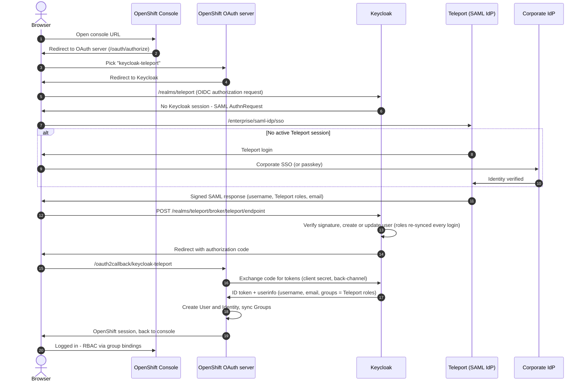

# OpenShift Console SSO with Teleport

Log into the RedHat OpenShift web console (and `oc login --web`) as your
**Teleport** user, with your Teleport **roles** deciding what you can do in
the cluster. No kubeadmin password, no separate OpenShift account.

```
you → OpenShift Console → OpenShift OAuth server → Keycloak → Teleport → done
                          (speaks OIDC)            (translates)  (speaks SAML)
```

The setup runs without long-lived credentials: exactly one shared secret
exists (OpenShift's OAuth schema requires it), it lives only in two Kubernetes
Secrets, never touches a laptop or a ConfigMap, and rotates with one command.

Deep dives: [architecture & security model](docs/architecture.md) ·
[troubleshooting](docs/troubleshooting.md)

## Why Keycloak?

OpenShift's OAuth server accepts OIDC identity providers but not SAML.
Teleport can act as an identity provider, but only over SAML (an Enterprise
feature). The two don't share a protocol, so Keycloak sits in the middle: it
logs you in against Teleport (SAML) and presents you to OpenShift as an OIDC
user, passing your Teleport roles through as the `groups` claim.

There is no simpler path: the console ignores injected JWT headers (it only
trusts its OAuth server), Teleport has no OIDC provider, and OpenShift's
request-header option needs an mTLS proxy certificate Teleport can't present.

## How a login works



1. The console sends you to the cluster's OAuth server, which redirects to
   Keycloak. (While kubeadmin exists you pick `keycloak-teleport` from a
   two-button page; after you remove kubeadmin there's no page at all.)
2. Keycloak has no users or login page of its own — it immediately forwards
   you to Teleport as a SAML request.
3. **Teleport is where authentication happens**, with whatever you already
   enforce: corporate SSO, passkeys, MFA, device trust. With a live Teleport
   session this hop is invisible.
4. Teleport returns a signed SAML assertion — your username, your current
   Teleport roles, your email. Keycloak verifies the signature (public
   certificate; Keycloak holds no Teleport credential) and hands OpenShift an
   authorization code.
5. The OAuth server redeems the code (the only server-to-server hop, and the
   only use of the one shared secret), creates your OpenShift User, and syncs
   your Teleport roles as OpenShift Groups.
6. From there it's ordinary Kubernetes RBAC: the ClusterRoleBindings in
   `openshift/40-rbac-group-bindings.yaml` decide what each group can do —
   for example `full-access` → `cluster-admin`, `editor` → `edit`,
   `access` → `view` (rename to match your Teleport roles).

Groups re-sync on every login, so a role granted through a Teleport Access
Request appears in the console on your next login and disappears when it
expires. Roles come from Teleport's identity — including just-in-time grants
your corporate IdP has never heard of ([details](docs/architecture.md)).

## Prerequisites

- A **Teleport Enterprise** cluster and a user allowed to manage
  `saml_idp_service_provider` resources. `tsh`/`tctl` installed locally.
- Admin access to the OpenShift cluster (`oc` as kubeadmin or equivalent).
- `envsubst` (macOS: `brew install gettext`), `curl`, `openssl`.

Tested with OpenShift 4.21 (`claims.groups` needs ≥ 4.10), Keycloak 26.7.0,
Teleport Enterprise 18.10.

## Setup

Run everything from the repo root. Each step has a ✓ check — don't move on
until it passes.

### 1. Fill in your settings

```bash
cp demo.env.example demo.env
```

Edit `demo.env`: your Keycloak hostname (any name under the cluster's
`*.apps...` wildcard domain), the OAuth and console route hosts, and your
Teleport proxy. **This file holds no secrets.**

### 2. Render the manifests

```bash
scripts/render.sh
```

Substitutes the hostnames into the templates that need them and writes
`rendered/`. The realm JSON is deliberately not rendered — Keycloak resolves
its `${VAR}` placeholders from the pod environment, which is how the client
secret stays out of the ConfigMap.

> ✓ The script lists the rendered files and exits 0.

### 3. Generate the OIDC client secret

```bash
scripts/rotate-client-secret.sh
```

Generates a random secret in memory and writes it to the only two places that
need it: a Secret in the `keycloak` namespace (read by the pod env) and a
Secret in `openshift-config` (read by the OAuth server). Never displayed,
never on disk.

> ✓ Both Secrets reported set (`keycloak not deployed yet` is expected).

### 4. Sync Teleport's SAML signing certificate

```bash
tsh login --proxy=<your-teleport-proxy>
scripts/sync-saml-cert.sh
```

Exports the certificate Keycloak uses to verify Teleport's signatures (public
key material, not a secret) into the `teleport-saml-cert` ConfigMap. Re-run
after a Teleport CA rotation; it's idempotent.

> ✓ `teleport-saml-cert ConfigMap updated`.

### 5. Deploy Keycloak

```bash
oc create configmap keycloak-realm-teleport \
    --from-file=keycloak/realm-teleport.json -n keycloak
oc apply -f rendered/keycloak/
```

First start takes ~1 minute (realm import).

> ✓ Pod Ready, and the issuer matches byte-for-byte what OpenShift will expect:
>
> ```bash
> oc get pods -n keycloak
> curl -sk https://<KC_ROUTE_HOST>/realms/teleport/.well-known/openid-configuration | grep -o '"issuer":"[^"]*"'
> # → https://<KC_ROUTE_HOST>/realms/teleport
> ```

### 6. Register Keycloak with Teleport

```bash
tctl create -f rendered/teleport/saml-idp-service-provider.yaml
```

> ✓ `tctl get saml_idp_service_provider/openshift-console` shows the resource.
> Optional: preview the asserted attributes with
> `tctl idp saml test-attribute-mapping --users <you> --sp rendered/teleport/saml-idp-service-provider.yaml`.

### 7. Test the Teleport half on its own

Open `https://<KC_ROUTE_HOST>/realms/teleport/account` in a browser. You
should bounce to Teleport (log in if prompted) and land back in Keycloak's
account console with no forms in between.

> ✓ The account console shows your Teleport username.

### 8. Point OpenShift at Keycloak

```bash
# The CA that signs the Keycloak route certificate (the ingress CA)
oc get cm default-ingress-cert -n openshift-config-managed \
    -o jsonpath='{.data.ca-bundle\.crt}' > ingress-ca.crt
oc create configmap keycloak-teleport-ca \
    --from-file=ca.crt=ingress-ca.crt -n openshift-config

# The OAuth identity provider and the group→role bindings
oc apply -f rendered/openshift/30-oauth-cluster.yaml
oc apply -f rendered/openshift/40-rbac-group-bindings.yaml
```

The OAuth server pods roll automatically; give it 2–3 minutes.

> ✓ `oc get co authentication` — Available=True, Progressing settles to False.

### 9. Log in

Open the console in a **private window** (so your kubeadmin session doesn't
interfere) and click **keycloak-teleport**. You'll pass invisibly through
Keycloak to Teleport and back in as your Teleport user.

> ✓ As kubeadmin: `oc get users identities groups` — your user exists and the
> groups mirror your Teleport roles. `scripts/verify.sh` checks the whole
> chain, including that no secret material sits in any ConfigMap.

### 10. (Optional) Remove kubeadmin

```bash
oc delete secrets kubeadmin -n kube-system
```

> ⚠️ **Irreversible** — run it only after step 9 passed and a Teleport role
> maps to cluster-admin. With one identity provider left, the console login
> page disappears entirely: console URL → Teleport → in. If you also access
> this cluster through a Teleport kube agent, that certificate-based path
> remains an independent break-glass admin route.

### 11. (Optional) Verify just-in-time access

Request and assume an extra role in Teleport, close the private window (that
ends the Keycloak session — required for roles to re-sync; see
[three sessions](docs/troubleshooting.md#three-sessions)), and log in again:
the new role appears as a group. When the request expires, the next login
removes it.

## Day-2 operations

**Add or change an access tier.** Edit
`openshift/40-rbac-group-bindings.yaml` — group name = Teleport role name —
and `oc apply`. No Keycloak or Teleport changes needed.

**Rotate the client secret.** `scripts/rotate-client-secret.sh` — updates both
Secrets and restarts Keycloak. A login attempted during the ~30s restart fails
once, then succeeds.

**Refresh the SAML certificate** (after a Teleport CA rotation).
`scripts/sync-saml-cert.sh` — idempotent; no-op when nothing changed.

**Keycloak admin console (rare).** No admin account exists by design. For
debugging, mint a temporary one — it dies on the next restart:

```bash
oc exec -it deployment/keycloak -n keycloak -- /opt/keycloak/bin/kc.sh bootstrap-admin user
```

**Upgrade Keycloak.** Bump the image tag in `keycloak/20-deployment.yaml` and
`oc apply`. State is disposable; the realm re-imports on start.

**Health check.** `scripts/verify.sh`.

## Auditing

The two halves of the audit trail live in different systems, by design:

**Logins — Teleport's audit log.** Every console login writes a
`SAML IdP authentication` event ("User [x] successfully authenticated to SAML
service provider [...]"), alongside the user's own SSO login and
certificate-issued events. View them in the Teleport web UI under **Audit**,
or query the audit API.

**Usage — OpenShift's audit log.** What a user does *after* login is
kube-apiserver traffic, attributed to their real username (that's the point
of federation — no more anonymous shared admin). Pull the per-action trail
with:

```bash
oc adm node-logs --role=master --path=kube-apiserver/audit.log | grep '"username":"<user>"'
```

**Kube/CLI access through a Teleport agent** (if you also run one) is the
deepest trail: Teleport records every request as its own audit event —
verb, path, response code, user — plus session recordings. Console SSO and
Teleport kube access complement each other; they don't overlap.

## Production notes

The shipped manifests favor the smallest footprint; adjust these when
graduating from evaluation:

- **Keycloak runtime** — ships as `start-dev`, single replica, no database
  (restarts lose only local sessions; users just log in again). For session
  persistence and HA, run `start` mode with PostgreSQL and ≥2 replicas; keep
  the realm JSON as the config source. With a persistent database, Keycloak's
  `sub` values become stable and you can tighten the OAuth CR from
  `mappingMethod: add` to `claim` (see `openshift/30-oauth-cluster.yaml`).
- **Route TLS** — edge termination means router→pod traffic is in-cluster
  HTTP; switch to `reencrypt` with a service-serving certificate if policy
  requires.
- **Session TTLs drive revocation latency** — a Teleport role change lands at
  the next full SAML exchange, i.e. when the Keycloak SSO session ends. Tune
  the realm's SSO timeouts and OpenShift's `tokenConfig` to match your
  requirements.
- **Automate the cert sync** — a CronJob using
  [Teleport Machine ID](https://goteleport.com/docs/machine-workload-identity/machine-id/)
  (kubernetes join, a bot role with `cert_authority: readnosecrets`) can run
  the equivalent of `scripts/sync-saml-cert.sh` with zero stored credentials.
- **Monitoring** — scrape Keycloak's readiness endpoint; alert on
  `AuthenticationError` in the `oauth-openshift` logs.
- **Shared clusters** — prefix the synced group names (assert a transformed
  attribute in `teleport/saml-idp-service-provider.yaml` and point Keycloak's
  `teleport-roles` mapper at it) if raw Teleport role names could collide with
  existing groups.

## Teardown

Unless you removed kubeadmin, every piece is independently reversible:

```bash
oc patch oauth cluster --type json -p '[{"op": "remove", "path": "/spec/identityProviders"}]'
oc delete -f rendered/openshift/40-rbac-group-bindings.yaml
oc delete user <your-user> ; oc delete identity --all ; oc delete group full-access editor access
oc delete ns keycloak
oc delete secret keycloak-teleport-client-secret -n openshift-config
oc delete configmap keycloak-teleport-ca -n openshift-config
tctl rm saml_idp_service_provider/openshift-console
```

## Repo layout

```
demo.env.example                  # your hostnames (copy to demo.env) — no secrets
scripts/render.sh                 # demo.env + templates → rendered/
scripts/rotate-client-secret.sh   # create/rotate the one shared secret, in-cluster only
scripts/sync-saml-cert.sh         # Teleport SAML cert → ConfigMap (idempotent)
scripts/verify.sh                 # end-to-end health + credential checks
keycloak/                         # namespace, config, deployment, service, route
keycloak/realm-teleport.json      # the entire Keycloak configuration (placeholders only)
teleport/saml-idp-service-provider.yaml   # registers Keycloak with Teleport's SAML IdP
openshift/30-oauth-cluster.yaml   # the OAuth identity-provider config
openshift/40-rbac-group-bindings.yaml     # Teleport role → ClusterRole tiers
docs/architecture.md              # trust boundaries, session model, credential inventory
docs/troubleshooting.md           # failure modes and fixes
```
