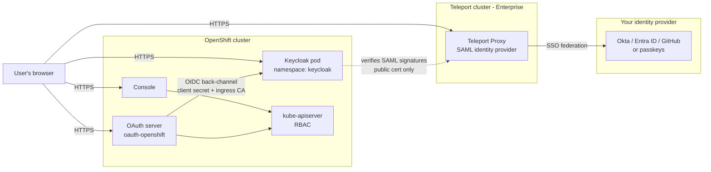

# Architecture & security model

This document describes the architecture for engineers and security
reviewers: components and trust boundaries, the full login sequence, the
session model, the identity mapping at each hop, the credential inventory with
compromise analysis, and the authorization model.

For why this uses identity federation rather than Teleport app access — and
when each pattern is the right choice — see
[App access or identity federation?](../README.md#app-access-or-identity-federation)
in the README.

## Components and trust boundaries

Key boundary facts:

- **All user-facing hops are front-channel browser redirects over HTTPS.** The
  only server-to-server call is the OAuth server's OIDC code→token exchange
  with Keycloak (authenticated by the single client secret, over TLS validated
  against the ingress CA you pin in `openshift-config/keycloak-teleport-ca`).
- **Keycloak never holds a credential for Teleport.** It verifies Teleport's
  SAML response signatures using Teleport's *public* signing certificate. A
  compromised Keycloak cannot log into Teleport or query it — there is no
  Teleport API access anywhere in this design.
- **Teleport never talks to OpenShift.** It only signs SAML assertions that
  travel through the user's browser.
- **Your corporate IdP is untouched.** Users authenticate to Teleport exactly
  as they already do (SSO connector or passkeys); this setup adds a consumer
  of Teleport identity, not a new login method.
- TLS terminates at the OpenShift router for Keycloak (edge Route); traffic
  from router to the Keycloak pod is in-cluster HTTP on the pod network.
  Harden to a re-encrypt Route with a service-serving certificate if in-cluster
  plaintext is out of policy.

## Login sequence

See the diagram in the [README](../README.md#how-a-login-works). Numbered
narrative with the protocol details:

1. The browser opens the console; the console redirects to the cluster OAuth
   server (`/oauth/authorize`), which shows its identity-provider list
   (`kube:admin` plus `keycloak-teleport`, until kubeadmin is removed).
2. Choosing `keycloak-teleport` starts a standard **OIDC authorization-code
   flow**: the OAuth server redirects the browser to Keycloak's authorization
   endpoint.
3. Keycloak's browser flow checks for an existing Keycloak session cookie. If
   none, the Identity Provider Redirector sends the browser straight to
   Teleport — Keycloak's own login page is never shown (there are no Keycloak
   users to log in as).
4. The browser carries a **SAML AuthnRequest** to Teleport's IdP endpoint
   (`/enterprise/saml-idp/sso`). If the user has no Teleport web session,
   Teleport runs its normal login first — your corporate SSO or passkey. This
   is where actual authentication happens, with whatever MFA/device policy
   Teleport enforces.
5. Teleport returns a **signed SAML response** asserting: `uid` (Teleport
   username), `eduPersonAffiliation` (the user's Teleport role names,
   multi-valued), and `mail`. The browser posts it to Keycloak's broker
   endpoint (the ACS URL registered in Teleport).
6. Keycloak verifies the signature against Teleport's public certificate,
   creates or updates the local user (`syncMode: FORCE` — every login
   overwrites username, email, and the roles attribute, so changes in Teleport
   always win), and redirects back to the OAuth server with an authorization
   code.
7. The OAuth server exchanges the code for tokens **back-channel**,
   authenticating with the client secret, and reads the claims:
   `preferred_username`, `email`, `name`, and `groups` (the Teleport roles,
   passed through verbatim).
8. The OAuth server creates/updates the OpenShift `User` and `Identity`
   objects and **synchronizes `Group` membership** from the `groups` claim:
   groups are created on demand, memberships added and removed, each managed
   group annotated `oauth.openshift.io/idp.keycloak-teleport: synced`. It then
   mints the OpenShift session token and returns the user to the console.
9. Authorization is ordinary Kubernetes RBAC: the ClusterRoleBindings in
   `openshift/40-rbac-group-bindings.yaml` bind those groups to cluster roles.

## Identity mapping at each hop

| Hop | Field | Value |
|---|---|---|
| Teleport → Keycloak (SAML) | `urn:oid:0.9.2342.19200300.100.1.1` (uid) | Teleport username |
| | `urn:oid:1.3.6.1.4.1.5923.1.1.1.1` (eduPersonAffiliation) | Teleport role names (multi-valued) |
| | `urn:oid:0.9.2342.19200300.100.1.3` (mail) | user email (via `attribute_mapping` on the Teleport side) |
| Inside Keycloak | username | from uid (`principalType: ATTRIBUTE`) |
| | user attribute `teleport_roles` | from eduPersonAffiliation (Attribute Importer, FORCE) |
| Keycloak → OpenShift (OIDC) | `preferred_username` | Keycloak username = Teleport username |
| | `email`, `name` | from the user profile |
| | `groups` | `teleport_roles` verbatim (multi-valued protocol mapper) |
| Inside OpenShift | `User` name | `preferred_username` |
| | `Identity` name | `keycloak-teleport:` (`sub` = Keycloak's internal user UUID) |
| | `Group` names | `groups` claim values = raw Teleport role names |

Because Keycloak storage is ephemeral, the `sub` for a given person changes
after a Keycloak restart. The OAuth CR therefore uses `mappingMethod: add`,
which attaches each new identity to the existing User named by
`preferred_username`. The username — the thing RBAC and audit key on — comes
from Teleport and is stable. Within a single identity provider this merge is
safe; if you later add a second IdP, review the mapping method per provider.
With a persistent Keycloak database, subs are stable and the stricter
`mappingMethod: claim` can be used instead.

Group names are deliberately unprefixed for legibility ("the group IS the
Teleport role"). On a shared cluster, prefix them by asserting a transformed
attribute from Teleport instead — see the README's Day-2 section.

## Session model

Three independent sessions exist after a login, with different lifetimes:

| Session | Held by | Default lifetime | Ends when |
|---|---|---|---|
| OpenShift OAuth token | browser ↔ OpenShift | 24h (OAuth CR `tokenConfig`) | console logout, token expiry, or `oc delete useroauthaccesstokens` |
| Keycloak SSO session | browser ↔ Keycloak | realm defaults (idle 30m / max 10h) | Keycloak session logout/expiry, or pod restart (ephemeral storage) |
| Teleport web session | browser ↔ Teleport | your Teleport cluster's session TTL | Teleport logout/expiry |

Consequences a security reviewer should know:

- **Role changes propagate on the next full SAML exchange**, not on token
  refresh. If the Keycloak session is still alive, a new console login reuses
  it and skips Teleport — so freshly granted or revoked Teleport roles appear
  only after the Keycloak session ends. For deterministic revocation, end the
  Keycloak session (private window, Keycloak session revocation, or lower the
  realm's SSO idle timeout — e.g. to a few minutes — in
  `realm-teleport.json`).
- **Console logout does not log the user out of Keycloak or Teleport.** This
  is standard federated-SSO behavior; document it for your users.
- **Immediate revocation** of an active OpenShift session is done on the
  OpenShift side (`oc delete useroauthaccesstokens --field-selector=...`),
  independent of the IdP chain.
- **Upstream revocation ordering**: disabling a user in the corporate IdP
  (Okta/Entra/…) prevents new Teleport logins but leaves existing Teleport
  sessions alive until expiry. A **Teleport lock** takes effect immediately at
  the Teleport layer and stops all future SAML assertions; the layers below
  (Keycloak SSO session, OpenShift token) then age out on their own TTLs — or
  are revoked directly as above.

## Credential inventory and compromise analysis

| Credential | Stored | Compromise impact | Mitigations |
|---|---|---|---|
| OIDC client secret (the only shared secret) | Two k8s Secrets: `keycloak/keycloak-oidc-client`, `openshift-config/keycloak-teleport-client-secret` | Holder can impersonate the OAuth server *to Keycloak* (redeem authorization codes). Cannot log in as anyone by itself — codes are only issued after a real Teleport/SSO login, and the registered redirect URI pins where they return. | Generated in-cluster, never on disk; one-command rotation (`scripts/rotate-client-secret.sh`); Secret RBAC + etcd encryption apply. Mandated by OpenShift's OAuth schema — no PKCE/mTLS/private-key-JWT alternative exists for the OpenID IdP type. |
| Keycloak admin account | **Does not exist** | — | Bootstrap admin is never created; realm is fully declarative. Temporary recovery account possible only with `oc exec` rights on the pod, and dies on restart. |
| Teleport SAML signing certificate | `teleport-saml-cert` ConfigMap | None — public key material | Refreshed by `scripts/sync-saml-cert.sh` (or the Machine ID automation in the README). |
| Ingress CA bundle | `keycloak-teleport-ca` ConfigMap | None — public trust material | — |
| kubeadmin password | until you remove it (README Step 10) | full cluster admin | delete after SSO-based cluster-admin is verified |

Tampering scenarios:

- **Keycloak pod compromise**: the attacker holds the client secret (env) and
  can mint tokens for arbitrary identities toward OpenShift *while the pod is
  compromised* — Keycloak is the identity bridge, so it is trusted by design.
  Contain with namespace RBAC (who can `exec`/read Secrets in `keycloak`),
  and audit `oc get identities` for logins that lack corresponding Teleport
  audit events. Teleport itself is unaffected (nothing to steal that reaches it).
- **Realm ConfigMap tampering** (e.g. disabling `validateSignature`): requires
  write access in the `keycloak` namespace; takes effect only on pod restart,
  and the ConfigMap is fully declarative in git — drift is one `diff` away.
  Treat write access to the `keycloak` namespace as equivalent to identity-
  provider admin.
- **What the design never exposes**: Teleport credentials or API access
  (Keycloak has none), your corporate IdP (only Teleport talks to it), user
  passwords (none exist anywhere in this chain).

## Authorization model

- Teleport role names arrive as OpenShift groups; access is plain Kubernetes
  RBAC via ClusterRoleBindings (`openshift/40-rbac-group-bindings.yaml`).
  Least-privilege tiers are edited there — no Keycloak or Teleport changes.
- Group membership is **owned by the IdP sync**: OpenShift adds *and removes*
  memberships in groups annotated as synced by this identity provider on every
  login. Manually created groups are never touched.
- Just-in-time access: a Teleport Access Request that grants a role makes that
  role appear in the next login's `groups` claim → new OpenShift group →
  whatever RBAC is bound to it, for exactly as long as the request lasts.

## Availability notes

- Keycloak is a single ephemeral replica with no database: restart loses local
  sessions (users just log in again) and nothing else. It is only in the path
  at *login time* — established console sessions and all `oc` traffic don't
  touch it.
- The OAuth server tolerates Keycloak downtime for everything except new
  keycloak-teleport logins; kubeadmin (if retained) and Teleport kube-agent
  access are unaffected.
- For the persistent/HA Keycloak configuration and other hardening steps, see
  the [Production notes](../README.md#production-notes) in the README.

## Tested versions

| Component | Version | Notes |
|---|---|---|
| OpenShift | 4.21 (self-managed, AWS) | OAuth `claims.groups` requires ≥ 4.10 |
| Keycloak | 26.7.0 | realm-import `${VAR}` env substitution verified on this version |
| Teleport | Enterprise Cloud 18.10 | SAML IdP is an Enterprise feature |
