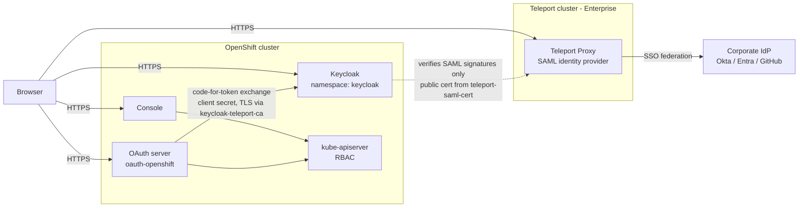
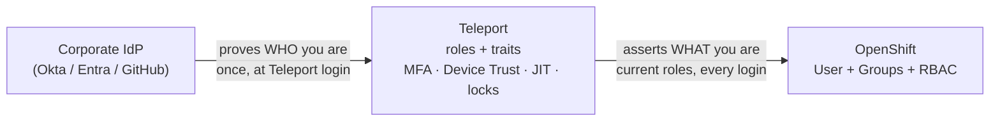

# Architecture & security model

Reference for engineers and security reviewers: trust boundaries, the login
sequence, identity mapping, the session model, and the credential inventory
with compromise analysis.

## Components and trust boundaries

- **All user-facing hops are front-channel browser redirects over HTTPS.** The
  only server-to-server call is the OAuth server's OIDC code→token exchange
  with Keycloak — authenticated by the setup's single client secret, over TLS
  validated against the CA pinned in `openshift-config/keycloak-teleport-ca`.
- **Keycloak holds no credential for Teleport.** It verifies Teleport's SAML
  signatures with Teleport's *public* signing certificate. A compromised
  Keycloak cannot log into or query Teleport.
- **Teleport never talks to OpenShift.** It only signs SAML assertions that
  travel through the user's browser.
- **The corporate IdP is untouched.** Users authenticate to Teleport exactly
  as before; this setup adds a consumer of Teleport identity, not a login
  method.
- TLS terminates at the OpenShift router for Keycloak (edge Route);
  router→pod traffic is in-cluster HTTP. Use a `reencrypt` Route with a
  service-serving certificate if in-cluster plaintext is out of policy.

## Where the identity comes from

Teleport plays both SAML positions at once. Upstream it is a *service
provider*: the corporate IdP authenticates the human once, at Teleport login,
and Teleport mints its own identity from that assertion — the SSO connector
maps IdP groups to Teleport roles, attributes become traits. From then on the
living identity is Teleport's: it can gain a role via an Access Request, lose
one, or be locked, without the corporate IdP knowing. Downstream Teleport is
the *identity provider*: it answers the console flow from its own session
(never bouncing back to the IdP), asserting the user's roles as they are at
that moment.

Consequences:

- Whatever Teleport enforces at its own door (per-session MFA, hardware keys,
  Device Trust) gates the console with zero OpenShift-side configuration.
- SSO-backed users' role *lists* are recomputed from the connector's
  attribute mapping at every corporate-IdP login — durable grants belong in
  connector-mapped roles or Access Lists, not one-off `tctl users update`.

## Login sequence

1. Console → cluster OAuth server (`/oauth/authorize`) → redirect to Keycloak
   (standard **OIDC authorization-code flow**).
2. Keycloak's browser flow finds no local session and its Identity Provider
   Redirector forwards the browser to Teleport as a **SAML AuthnRequest**
   (`/enterprise/saml-idp/sso`). Keycloak's own login page never appears.
3. Teleport authenticates the user if needed (corporate SSO or passkey, plus
   any MFA/device policy), then returns a **signed SAML response**: `uid`
   (Teleport username), `eduPersonAffiliation` (Teleport role names,
   multi-valued), `mail`.
4. Keycloak verifies the signature, creates or updates the local user
   (`syncMode: FORCE` — every login overwrites username, email, and the roles
   attribute, so Teleport always wins), and redirects back with an
   authorization code.
5. The OAuth server redeems the code **back-channel** (client secret) and
   reads `preferred_username`, `email`, `name`, `groups` (the Teleport roles,
   verbatim).
6. It creates/updates the OpenShift `User` and `Identity`, **synchronizes
   `Group` membership** from the `groups` claim (groups created on demand,
   memberships added and removed, each managed group annotated
   `oauth.openshift.io/idp.keycloak-teleport: synced`), and mints the
   OpenShift session token.
7. Authorization is ordinary Kubernetes RBAC via the ClusterRoleBindings in
   `openshift/40-rbac-group-bindings.yaml`.

## Identity mapping at each hop

| Hop | Field | Value |
|---|---|---|
| Teleport → Keycloak (SAML) | `urn:oid:0.9.2342.19200300.100.1.1` (uid) | Teleport username |
| | `urn:oid:1.3.6.1.4.1.5923.1.1.1.1` (eduPersonAffiliation) | Teleport role names (multi-valued) |
| | `urn:oid:0.9.2342.19200300.100.1.3` (mail) | email (via `attribute_mapping`) |
| Inside Keycloak | username | from uid (`principalType: ATTRIBUTE`) |
| | user attribute `teleport_roles` | from eduPersonAffiliation (Attribute Importer, FORCE) |
| Keycloak → OpenShift (OIDC) | `preferred_username` | Keycloak username = Teleport username |
| | `groups` | `teleport_roles` verbatim (multi-valued protocol mapper) |
| Inside OpenShift | `User` name | `preferred_username` |
| | `Identity` name | `keycloak-teleport:` (`sub` = Keycloak's internal user UUID) |
| | `Group` names | `groups` claim values = raw Teleport role names |

Because Keycloak storage is ephemeral, the `sub` for a given person changes
after a Keycloak restart. The OAuth CR therefore uses `mappingMethod: add`,
which attaches each new identity to the existing User named by
`preferred_username` — the stable key, owned by Teleport. Within a single
identity provider this merge is safe; review per-provider if you add another
IdP. With a persistent Keycloak database, subs are stable and the stricter
`claim` method can be used.

Group names are deliberately unprefixed ("the group IS the Teleport role").
On shared clusters, prefix them — see the README's production notes.

## Session model

Three independent sessions exist after a login:

| Session | Held by | Default lifetime | Ends when |
|---|---|---|---|
| OpenShift OAuth token | browser ↔ OpenShift | 24h (`tokenConfig`) | console logout, expiry, or `oc delete useroauthaccesstokens` |
| Keycloak SSO session | browser ↔ Keycloak | realm defaults (idle 30m / max 10h) | logout/expiry, or pod restart |
| Teleport web session | browser ↔ Teleport | your cluster's session TTL | Teleport logout/expiry |

- **Role changes propagate on the next full SAML exchange**, not on token
  refresh: while the Keycloak session lives, a new console login reuses it and
  skips Teleport. For deterministic re-sync, end the Keycloak session
  (private window, session revocation, or a short realm SSO idle timeout).
- **Console logout does not end the Keycloak or Teleport sessions** —
  standard federated-SSO behavior.
- **Immediate revocation** of an active OpenShift session:
  `oc delete useroauthaccesstokens` on the OpenShift side.
- **Upstream ordering**: disabling a user in the corporate IdP stops *new*
  Teleport logins; a **Teleport lock** takes effect immediately and stops all
  future SAML assertions; the layers below age out on their TTLs or are
  revoked directly.

## Credential inventory and compromise analysis

| Credential | Stored | Compromise impact | Mitigations |
|---|---|---|---|
| OIDC client secret (the only shared secret) | Two k8s Secrets: `keycloak/keycloak-oidc-client`, `openshift-config/keycloak-teleport-client-secret` | Impersonate the OAuth server *to Keycloak* (redeem codes). Cannot log in by itself — codes exist only after a real Teleport login, and the registered redirect URI pins where they return. | Generated in-cluster, never on disk; one-command rotation; Secret RBAC + etcd encryption. Required by OpenShift's OAuth schema — no PKCE/mTLS/private-key-JWT alternative exists. |
| Keycloak admin account | **Does not exist** | — | Bootstrap admin never created; temporary recovery needs `oc exec` on the pod and dies on restart. |
| Teleport SAML signing cert | `teleport-saml-cert` ConfigMap | None — public key material | Refreshed by `scripts/sync-saml-cert.sh`. |
| Ingress CA bundle | `keycloak-teleport-ca` ConfigMap | None — public trust material | — |
| kubeadmin password | Until removed (README step 10) | Full cluster admin | Delete after SSO-based cluster-admin is verified. |

Tampering scenarios:

- **Keycloak pod compromise**: the attacker holds the client secret and can
  mint tokens for arbitrary identities toward OpenShift while the pod is
  compromised — Keycloak is the identity bridge and is trusted by design.
  Contain with namespace RBAC (who can `exec`/read Secrets in `keycloak`),
  and audit `oc get identities` against Teleport's audit log. Teleport itself
  is unaffected — there is nothing in the pod that reaches it.
- **Realm ConfigMap tampering** (e.g. disabling `validateSignature`): needs
  write access in the `keycloak` namespace, takes effect only on restart, and
  the ConfigMap is fully declarative in git — drift is one `diff` away. Treat
  namespace write access as identity-provider admin.
- **Never exposed anywhere**: Teleport credentials or API access, the
  corporate IdP, user passwords.

## Availability

Keycloak is a single ephemeral replica and is only in the path at *login
time* — established console sessions and `oc` traffic never touch it. A
restart loses local sessions (users log in again); configuration re-imports.
kubeadmin (if retained) and Teleport kube-agent access are independent of the
whole chain. For the persistent/HA variant, see the README's production notes.

## Tested versions

| Component | Version | Notes |
|---|---|---|
| OpenShift | 4.21, self-managed | OAuth `claims.groups` requires ≥ 4.10 |
| Keycloak | 26.7.0 | realm-import `${VAR}` env substitution verified |
| Teleport | Enterprise 18.10 | SAML IdP is an Enterprise feature |
